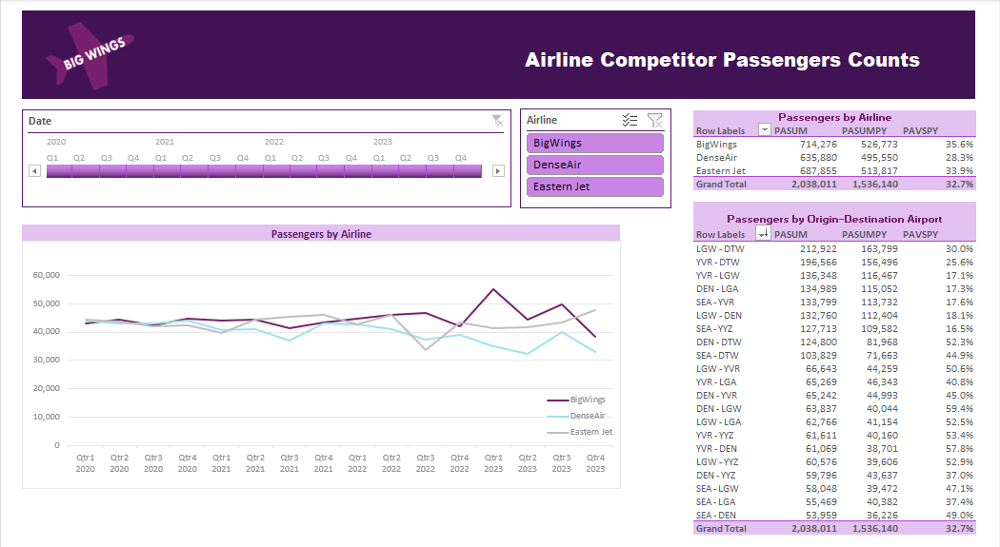
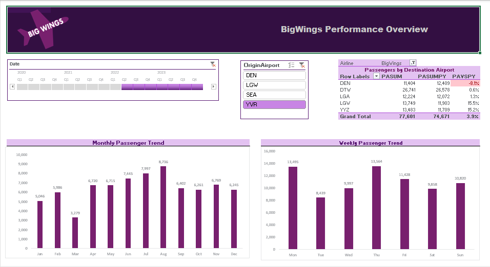

# ✈️ BigWings vs Competitors - Airline Passenger Analysis


Interactive Excel dashboards analyzing BigWings Airlines’ performance and competitive position. Built with Pivot Tables, Charts, and Slicers to track passenger trends, market share, top routes, and competitor comparisons.

------------------------------------------------------------------------

## 🎯 Objective

This project analyzes airline passenger traffic to compare **BigWings Airlines** with other competitors (DenseAir, Eastern Jet, and others). The goal is to evaluate **market share, route performance, airport hubs and passenger growth trends** to understand how BigWings performs against the industry..

------------------------------------------------------------------------

## 🛠️ Tools Used

-   **Excel** → Data exploration and validation
-   **Power Pivot** → Data Modeling
-   **DAX Measures** → KPI calculations for comparison

------------------------------------------------------------------------

## 📑 Table of Contents

-   [❓ Business Questions](#-business-questions)
-   [📌 Project Workflow](#-project-workflow)
-   [⚙️ Data Model](#-data-model)
-   [📊 Key Metrics](#-key-metrics)
-   [📈 Analysis & Insights](#-analysis--insights)
-   [🛠️ Tools & Techniques Used](#️-tools--techniques-used)
-   [🔑 Key Business Insights](#-key-business-insights) 
-   [🏁 Conclusion](#-conclusion) 

------------------------------------------------------------------------

## ❓ Business Questions

This project aims to answer the following: 
1. **Market Share**
    - What % of total passengers does BigWings control?
    - How does its market share evolve over time?

2.  **Route Performance**
    -   Which routes are strongest for BigWings vs competitors?
    -   What are the top 10 busiest routes overall?
    -   
3.  **Airport Hubs**
    -   Which airports contribute most to BigWings traffic?
    -   Does BigWings dominate specific airports?
4.  **Growth & Seasonality**
    -   How is BigWings growing compared to last year (YoY)?
    -   Are there seasonal peaks (e.g., summer/winter travel)?
    -   Impact of Months and Weekdays.
      
5.  **Competitor Benchmarking**
    -   How does BigWings compare to DenseAir and Eastern Jet?
    -   Which competitor is closest in terms of growth & routes?

------------------------------------------------------------------------

## ⚙️ Data Model

The analysis is based on a **star schema** data model:

-   **Fact_Flight** → Passenger Count, Airline, Date, Route (Origin &
    Destination Airports)
-   **Dim_Dates** → Calendar attributes (Year, Month, Quarter, Week,
    Day)
-   **Dim_Airport** → Airport details (Code, Name)

**Schema:**

    Dim_Dates ----< Fact_Flight >---- Dim_Airport

------------------------------------------------------------------------

## 📌 Project Workflow  

### 1️⃣ Load Data into Model  
From [`complete_analysis.xlsx`](./complete_analysis.xlsx), the following tables were loaded into the **Power Pivot Data Model**:  
- `Fact_Flight`  
- `Dim_Dates`  
- `Dim_Airport`  

---

### 2️⃣ Adjust Data Types  
- `Fact_Flights[Date]` → **Date**  
- `Dim_Dates[Date]` → **Date**  

---

### 3️⃣ Mark Date Table  
- Marked `Dim_Dates` as the **Date Table** (using the `Date` column).  
- Enabled **Time Intelligence Functions** in DAX.  

---

### 4️⃣ Sort Columns for Correct Order  
- `Month` sorted by `MonthNum` → (*Jan, Feb, Mar…*).  
- `Day of Week` sorted by `WeekDayNum` → (*Mon, Tue, …*).  

---

### 5️⃣ Relationships Setup  
In **Diagram View**, established relationships:  

	Dim_Dates ----< Fact_Flight >---- Dim_Airport

---

### 6⃣ DAX Calculations  

#### 🔹 Calculated Columns  

**Store Type (Friendly Names)**  
```DAX
	Quarter = CONCATENATE("Qtr",  CEILING(Dim_Dates[MonthNum]/3,1))
```

```DAX
	OriginDestination = Fact_Flights[OriginAirport] & " - " & Fact_Flights[DestinationAirport]
```  

---

#### 🔹 Measures  

```DAX
    PASUM:=SUM(Fact_Flights[Passenger Count])
```

```DAX 
    PASUMPY:=CALCULATE([PASUM], SAMEPERIODLASTYEAR(Dim_Dates[Date]))
```

```DAX
    PAVSPY:=DIVIDE(([PASUM]-[PASUMPY]), [PASUMPY], "NA")
```

```DAX    
    PASUM_BIGWINGS:=CALCULATE([PASUM], Fact_Flights[Airline] = "BigWings")
```

```DAX    
    MarketShare_BIGWINGS:=DIVIDE([PASUM_BIGWINGS], CALCULATE([PASUM],  ALL(Fact_Flights[Airline])), 0)
```

```DAX
    MarketShare:=DIVIDE([PASUM], CALCULATE([PASUM], ALLSELECTED()), 0)
```

---

### 7️⃣ Competitive Analysis Dashboard  

**Pivot Tables**  
- `PivotAirline` → Passengers by Airlines
- `PivotOD` → Passengers by Origin to Destination

**Filters**  
- 3 Slicers: **SlicerAirline**  
- 1 Timeline: **Quarterly filter**  

**Visualization**  
- Built a **Line Chart** to display **monthly passengers trends all three airlines**  

**Interactivity**  
- Connected the **Slicers** and **Timeline** only to the **relevant pivot tables and chart** for **dynamic filtering**  

---

### 8⃣ BigWings Performance Dashboard  

**Pivot Tables**  
- `PivotDestinationAirport` → Passengers by Destination Airport

**Filters**  
- Slicer: **SlicerOriginAirport**  
- Timeline: **Quarterly filter (same as Business Overview Dashboard)**  

**Visualization**  
- Built two bar charts one for monthly trend and one for weekly **store performance by category, manager, and time**  

**Interactivity**  
- Connected the **Slicers** and **Timeline** only to the **relevant pivot tables** for **dynamic filtering**  
- Ensured pivot tables **do not auto-fit column widths** each time a slicer is applied (disabled *Autofit Column Width on Update*)  

---

## 🖥️ Dashboard 1 – Business Overview
**File:** `complete_analysis.xlsx`

### Key Features
- Interactive **slicers** for Date and Airline
- KPI metrics: Units, Margin %, Passengers, Passengers Count Current vs Prior Year (SalesVsPY)  
- Pivot tables showing:
  - Passengers Count by Airlines
  - Passengers by Origin-Destination Airport
- Passengers Count Trend by Airlines (Line chart)

### Screenshot


---

## 🖥️ Dashboard 2 – BigWings Performance Overview
**File:** `complete_analysis.xlsx`

### Key Features
- Interactive **slicers** for Origin Airport and Date  
- BigWings performance broken down by:
  - Destination Airport
  - Slice Destination Table by Origin Airport Slicer to see BigWings performance in different routs
  - Prior year comparison with conditional formatting   

### Screenshot


------------------------------------------------------------------------

## 📈 Analysis & Insights

### 1. Passenger Trends Over Time

#### Monthly Trend
- Passenger numbers peak in **September (63,160)** and **January (63,863)**.  
- Consistently strong volumes in **Q1 (Jan–Mar)** and **Q3 (Jul–Sep)**.  
- Lowest traffic is in **December (51,231)** and **November (55,137)**.  

📌 **Insight**: Passenger demand is **steady across most months**, with slight dips at year-end.

#### Weekly Trend
- **Friday (105,791)** is the busiest travel day.  
- Other strong days: **Monday (103,302)**, **Tuesday (102,720)**, and **Wednesday (101,952)**.  
- **Sunday (99,418)** is the weakest day, but still near 100k passengers.  

📌 **Insight**: Weekdays, especially **Friday**, drive the highest volumes.  

---

### 2. Market Share

- **Total Passengers (PASYTD)**: 714,276  
- **BigWings Passengers (PASUMPY)**: 526,773  
- **Growth vs last year (PASYSPY)**: **+35.6%** 🚀  

### By Destination Airport
- **DTW**: Largest volume (**223,352**) with strong growth (**+39.3%**).  
- **DEN**: 81,574 passengers (**+31.7% growth**).  
- **LGA**: 109,802 passengers (**+32.2% growth**).  
- **LGW**: 88,503 passengers (**+33.2% growth**).  
- **YYZ**: 110,571 passengers (**+34.9% growth**).  

📌 **Insight**: Growth is **strong and broad-based across all hubs**, led by **Detroit (DTW)**.

---

### 3. Route Performance

### Top Routes (by volume)
1. **DTW** – 223,352  
2. **YYZ** – 110,571  
3. **LGA** – 109,802  
4. **LGW** – 88,503  
5. **DEN** – 81,574  

📌 **Insight**: **DTW is the dominant hub**. Growth is healthy across all routes (30–40%).  

---

### 4. Airport Hub Analysis

### Top Airports by Passenger Count
- **DTW** – 223k  
- **YYZ** – 111k  
- **LGA** – 110k  
- **LGW** – 89k  
- **DEN** – 82k  

📌 **Insight**: BigWings shows **balanced growth across multiple hubs**, ensuring reduced over-reliance on a single airport.  

---

### 5. Seasonality

- **Peak Months**: September and January (>63k).  
- **Slow Months**: November and December (<56k).  
- **Day-of-Week Effect**: **Friday peaks** (>105k), while **Sunday** is lowest (~99k).  

📌 **Insight**: Growth is **stable across months**, with **Friday demand surge** likely linked to both business and leisure travel.  

---

## 🏁 Conclusion

- BigWings is experiencing **explosive YoY growth (+35.6%)**.  
- **DTW is the backbone hub**, but **YYZ, LGA, and LGW** are also scaling fast.  
- Demand patterns highlight **weekday business travelers** and **steady monthly volumes**, with opportunities to boost year-end traffic.  

---
